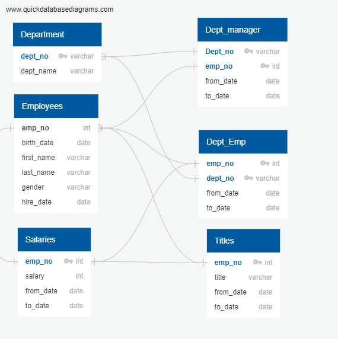

# Pewlett-Hackard-Analysis
## Overview of the analysis:
The purpose of this analysis was to help Pewlett-Hackard plan for a retirement wave in order to hire and train new staff.

## Results:
At first, we generated an entity relationship diagram (ERD) to help us visualize the links between our 6 different tables for our queries .



We sorted employees by their numbers, names and titles who were born between 1952 and 1955 inclusively and saved the information into a new table.  We eliminated duplicate rows for employees which had occupy more than one position during their stay with the company by using the `DISTINCT ON` function to generate the unique_titles table. 

```
SELECT DISTINCT ON (emp_no) emp_no,
first_name,
last_name,
title
INTO unique_titles
FROM retirement_titles
ORDER BY emp_no, to_date DESC;
```


From the unique_titles table we counted the number of retiring employees using the following code:

```
-- Retiring employees
SELECT COUNT(title), title
INTO retiring_titles
FROM unique_titles
GROUP BY title
ORDER BY COUNT(title) DESC;
```


In the second deliverable, we joined three tables in order to select employees born in 1965 and still currently employed with the code below:

```
SELECT DISTINCT ON (e.emp_no) e.emp_no,
	e.first_name,
	e.last_name, 
	e.birth_date,
	de.from_date,
	de.to_date,
	ti.title
INTO mentorship_eligibilty
FROM employees AS e
	INNER JOIN dept_emp AS de
		ON e.emp_no = de.emp_no
	INNER JOIN titles AS ti 
		ON e.emp_no = ti.emp_no
WHERE (e.birth_date BETWEEN '1965-01-01' AND '1965-12-31')
AND (de.to_date = '9999-01-01')
ORDER BY e.emp_no;
```


This returned a list of employees who are close to retiring and who can be eligible for mentorship opportunity.

## Summary:
Overall, this project improved our ability to make multiple queries using more than one table to answer our specific questions. Although the module instruction requested the number of retiring employees for deliverable one, we had to omit selecting for current employees to get the same table. Some employees may be retired for many years or even deceased with the module code so we would have to add the  ` to_date = '9999-01-01'` code to be more accurate.
